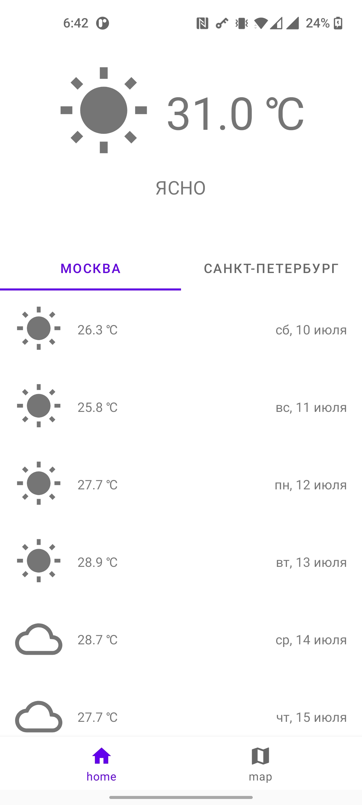
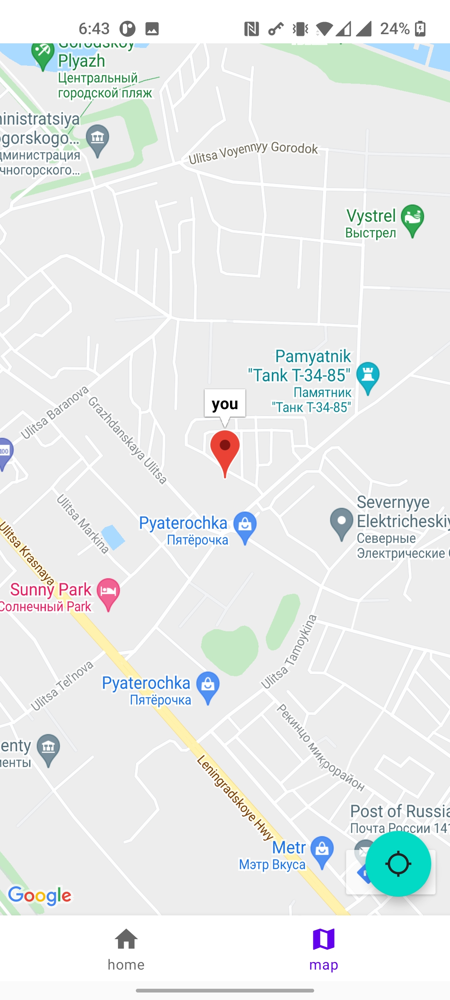
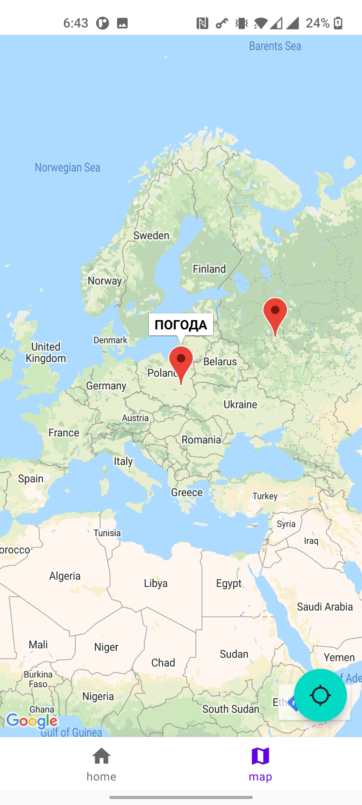
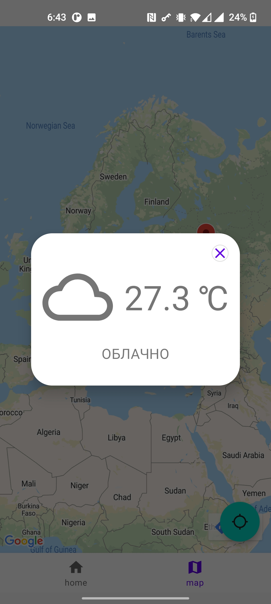

# TestApplicationWeather

## Table of Contents

- [Description](#description)
- [Tools](#tools)
- [Installation](#installation)
- [Screenshots](#screenshots)

### Description

Test application with some interesting content but nothing more 

### Tools

- Navigation component (Jetpack's navigation)
- Bottom navigation bar
- Google Maps SDK
- Location Manager
- ViewPager2

### Installation
You can use [release](https://github.com/Slex93/TestApplicationWeather/releases/) 

### Screenshots

- #### Main screen
 

- #### Current user location
 

- #### See weather where you want
 

- #### Weather information dialog

